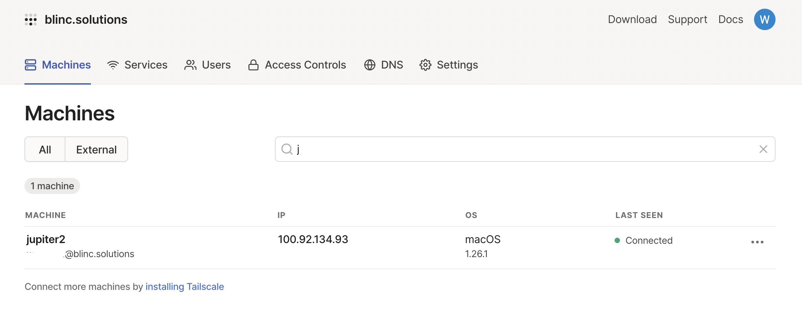

# OPTIONAL: Configuring Tailscale VPN


::: tip NOTE Consider this section only if you intend to connect to you **node machine** remotely.
:::

Tailscale is an open source p2p VPN tunnel and hosted endpoint discovery service ([how it works](https://tailscale.com/blog/how-tailscale-works/)). This facilitates all the NAT traversal required to establish an end-to-end encrypted path between your machine and your node without sending any sensitive traffic to a centralized server. 

In short, you will be able to SSH securely into your node **and** monitor your Graphana dashboard from anywhere in the world and without exposing your SSH port to the internet. 

First, create a free account on [Tailscale](https://tailscale.com/). Tailscale requires the use of an SSO identity provider such as Google, GitHub, Okta, Microsoft, etc.  For [details visit their SSO Page](https://tailscale.com/kb/1013/sso-providers/)  It is recommended that you enable 2FA (Two Factor Authentication) on which ever identity provider you choose for added security.


[Follow their onboarding guide](https://tailscale.com/kb/1017/install/) to install Tailscale on your **client**. Once completed you should see your computer as 'connected' on the [Tailscale dashboard](https://login.tailscale.com/admin/machines).

<center>



</center>

Now it's the time to install Taiscale on your node ([Ubuntu Install Instructions ](https://tailscale.com/kb/1039/install-ubuntu-2004/), [UFW Configuration Instructions](https://tailscale.com/kb/1077/secure-server-ubuntu-18-04/)). **Run these on the node machine.**

Add Tailscale’s package signing key and repository:

```shell
curl -fsSL https://pkgs.tailscale.com/stable/ubuntu/focal.noarmor.gpg | sudo tee /usr/share/keyrings/tailscale-archive-keyring.gpg >/dev/null
curl -fsSL https://pkgs.tailscale.com/stable/ubuntu/focal.tailscale-keyring.list | sudo tee /etc/apt/sources.list.d/tailscale.list
```
Install Tailscale:

```shell
sudo apt-get update
sudo apt-get install tailscale
```
Authenticate and connect your machine to your Tailscale network:

```shell
sudo tailscale up
```

You’re connected! You can find your Tailscale IPv4 address by running:

```shell
tailscale ip -4
```
You should now see your node machine added to the on the [Tailscale dashboard](https://login.tailscale.com/admin/machines).
You may also change the name of the **node machine** through the dashboard, e.g. to `rocketnode`.


It is suggested to [disable key expiry](https://tailscale.com/kb/1028/key-expiry) to prevent the need to periodically re-authenticate.

You should now be able to `exit` the session and ssh again into the **node machine** through Tailscale using `ssh your.user@rocketnode`.

::: warning NOTE
In case you modified the ssh port of the **node machine** by editing `/etc/ssh/sshd_config` you should either make it `22` again or use `ssh your.user@rocketnode -p your.port`
:::

You can now also visit `rocketnode:3001`in your web browser to access your Grafana dashboard from your **client**.

In case the connection is working, you can now set a rule to accept any incoming ssh connections over Tailscale. **Run these on the node machine.**

```shell
sudo ufw allow in on tailscale0 comment 
sudo ufw allow 41641/udp
```
Remove the ssh port added before from the firewall:

```shell
sudo ufw delete "22/tcp" comment 'Allow SSH'
```
Once you’ve set up firewall rules to restrict all non-Tailscale connections, restart ufw and ssh:

```shell
sudo ufw reload
sudo service ssh restart
```
Let's make sure that everything is working as expected.
First, let’s `exit` the existing ssh session (remember to keep one backup ssh session).

Then, let’s try to connect to the **node machine** with its public address. You should see that we’re not able to connect, and the operation times out:

```shell
ssh your.user@server.public.ip
ssh: connect to host <server host ip> port 22: Operation timed out
```
Now, let’s try to ssh in using the Tailscale IP address:

```shell
ssh your.user@rocketnode
```

If it works, you did everything right!

Feel free to remove the port forwarding in the router for the ssh connection as well. 

Tailscale is a very powerful tool, we have barley scratched the surface of its abilities here.  [Review their documentation](https://tailscale.com/kb/start/) for more details!
